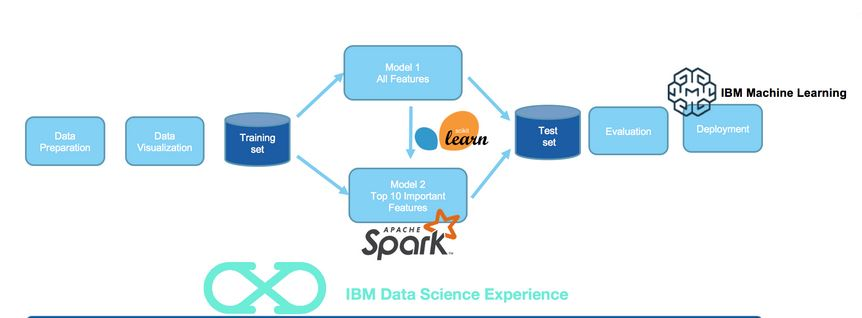
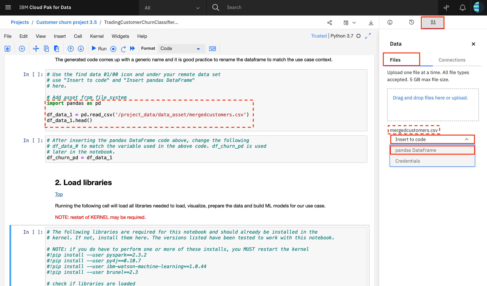
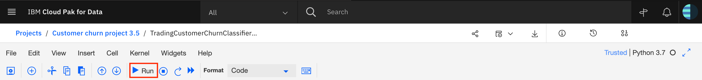
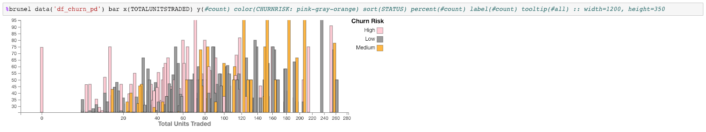
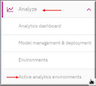
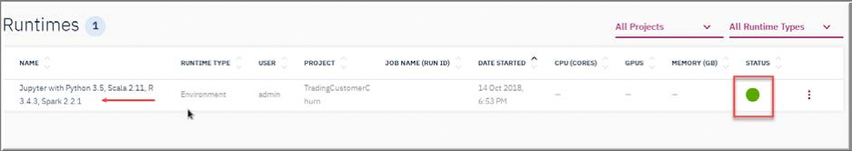

# Infuse AI into your application

In this code pattern, we will create and deploy a customer churn prediction model using IBM Cloud Private for Data. First, we will load customer demographics and trading activity data into Db2 Warehouse. Next, we'll use a Jupyter notebook to visualize the data and build hypotheses for prediction.
Finally, the notebook will build, test, and deploy a prediction model.

The use case describes a stock trader company that can use churn prediction to target offers for at-risk customers. Once deployed, the model can be used for inference from an application using the REST API.

When the reader has completed this code pattern, they will understand how to:

* Load data into Db2 Warehouse
* Run a Jupyter notebook
* Visualize data using Brunel
* Create a model using Spark ML library
* Use Watson Machine Learning to expose the model as a RESTful API endpoint
* Access the model from a remote app for inference (churn risk prediction)



## Flow

1. Data is loaded into Db2 Warehouse
1. Jupyter notebook accesses data
1. Jupyter notebook uses Brunel for information visualization
1. Jupyter notebook uses Spark ML library to create a model
1. Jupyter notebook deploys the model to Watson Machine Learning
1. Remote applications access the model via the REST API

## Prerequisites

This code pattern assumes you have are using IBM Cloud Platform for Data.

The following add-ons are required:

* Db2 Warehouse
* Watson Machine Learning

<!--
Prereqs (for using the Db2 Warehouse add-on):
* Install Db2 Warehouse as an add-on feature
* A database instance needs to be created
* The user needs to be given access to the database
 -->

## Steps

Sign in to your IBM Cloud Private for Data web client. All of the steps are performed using the web client unless stated otherwise.

1. [Clone the repo](#1-clone-the-repo)
2. [Load the data into Db2 Warehouse](#2-load-the-data-into-db2-warehouse)
3. [Set up an analytics project](#3-set-up-an-analytics-project)
4. [Create the notebook](#4-create-the-notebook)
5. [Insert Spark DataFrame](#5-insert-spark-dataframe)
6. [Run the notebook](#6-run-the-notebook)
7. [Analyze the results](#7-analyze-the-results)

### 1. Clone the repo

Clone the `icp4d-customer-churn-classifier` repo locally. In a terminal, run the following command:

```bash
git clone https://github.com/IBM/icp4d-customer-churn-classifier
```

### 2. Load the data into Db2 Warehouse

If you created a Db2 Warehouse database deployment in your IBM Cloud Private for Data cluster, you can access the integrated database console to complete common tasks, such as loading data into the database. This is a prerequisite to follow the instructions here and in the notebook, but you could easily adapt this code pattern to accept the data from another source.

#### Open the database

- [ ] Use the left menu's `Collect` drop-down list and click on `My data`.
- [ ] Click on the `Databases` tab.
- [ ] You should see a Db2 Warehouse tile with a status of `Available` (otherwise revisit the prerequisites and ensure your userid has access to a database).
- [ ] Click on the tile action menu (vertical 3 dots) and select `Open`.

#### Load the data

- [ ] Click on the upper-right `☰ Menu` and select `Load`.
- [ ] Use drag-and-drop or click `browse files` and open the `data/03-mergedcustomers.csv` file from your cloned repo.
- [ ] Click `Next`.
- [ ] Select or create the schema to use for the data.
- [ ] Select or create the table to use for the data.
- [ ] Click `Next`.
- [ ] Ensure that the data is being properly interpreted. For example, specify that the first row in the CSV file is a header and ensure that the comma separator is used.
- [ ] Click `Next`.
- [ ] Review the summary and click `Begin Load`.

#### Collect the database URL and credentials

- [ ] Go back to `Collect ▷ My data ▷ Databases ▷ Db2 Warehouse` tile.
- [ ] Click on the tile action menu (vertical 3 dots) and select `Details`.
- [ ] Copy the `Username`, `Password`, and `JDBC Connection URL` to use later.

### 3. Set up an analytics project

To get started, open the `Projects` page and set up an analytics project to hold the assets that you want to work with, and then get data for your project.

#### Create a project

- [ ] Go to the `Projects` list and click `+ New project`.
- [ ] Make sure `Analytics project` is select.
- [ ] Provide a `Project name`.
- [ ] Click `OK`.
- [ ] Stay on the `New` tab.
- [ ] Optionally, add a `Description`
- [ ] Click `Create`.

#### Add the data asset

- [ ] Use the left menu to go back to `Projects`.
- [ ] Select the project you created.
- [ ] In your project, use the `Data Sources` tab, and click `+ Add Data Source`.
- [ ] Provide a `Data source name` and `Description`.
- [ ] Use the `Data source type` drop-down list to select `Db2 Warehouse on Cloud`.
- [ ] Fill in the `JDBC URL`, `Username`, and `Password` that you collected earlier.
- [ ] Click the `Test Connection` button and make sure your test connection passed.
- [ ] Click on `+ Add remote data set`.
- [ ] Provide a `Remote data set name` and a `Description`.
- [ ] Provide a `Schema`. This is the schema that you used when you created the table.
- [ ] Provide the table name (that you used when you loaded the CSV data).
- [ ] Click `Create`.

### 4. Create the notebook

To create and open the notebook from a file:

- [ ] In your project, using the `Assets` tab, click `Notebooks`.
- [ ] Click on `+ Add Notebook`.
- [ ] Select the `From File` tab:
- [ ] Provide a notebook `Name` and `Description`.
- [ ] Use drag-and-drop or click `browse` and open the `notebooks/TradingCustomerChurnClassifierSparkML.jupyter-py36.ipynb` file from your cloned repo.
- [ ] Click `Create`.

### 5. Insert Spark DataFrame

Now that you are in the notebook, add generated code to insert the data as a DataFrame and fix-up the notebook reference to the DataFrame.

- [ ] Place your cursor at the last line of the following cell:

  ```python
  # Use the find data 10/01 icon and under your remote data set
  # use "Insert to code" and "Insert Spark DataFrame in Python"
  # here.

  ```

- [ ] Click the *find data* `10/01` icon on the menu bar (last icon).
- [ ] Using the `Remote` tab under `10/01`, find the data set that you added to the project, click `Insert to code` and `Insert Spark DataFrame in Python`.

  

- [ ] The inserted code will result in a DataFrame assigned to a variable named `df1` or `df_data_1` (perhaps with a different sequence number). Find the code cell like the following code block and edit the `#` to make it match the variable name.

  ```python
  # After inserting the Spark DataFrame code above, change the following
  # df# to match the variable used in the above code. df_churn is used
  # later in the notebook.
  df_churn = df#
  ```

### 6. Run the notebook

Run the entire notebook using the menu `Cell ▷ Run All` or run the cells individually with the play button as shown here.



### 7. Analyze the results

#### When the notebook was created

* A pod was instantiated – which means loading a complete compute Jupyter notebook environment (7+ GB) with all the artifacts from the private ICP-D registry.
* IBM Cloud Private schedules this pod on any VM – wherever CPU and memory resources are available.
* IP addresses and connections are all configured automatically.
* The same working environment can be used by multiple users. If a single pod's resources are not sufficient, another environment is created automatically.
* When the number of users grow, you can add more machines to the ICP-D cluster and scheduling of resources is handled automatically.
* ICP-D's scale-out model is pretty effective.
* You no longer have to wait days or even weeks to get the compute resources.
* IBM Cloud Private makes 40 – 60 percent more efficient use of compute resources. This means more users can be accommodated with same compute capacity. As one task completes, its resources are freed up to work on next one.

#### When you ran the notebook

* During the execution of a cell in a Jupyter notebook, an asterisk `[*]` displays in the square bracket which changes to a sequence number when execution of that cell completes.

* The mix of documentation, code, and output can make a Jupyter output self-explanatory. This also makes it a great environment to "show your work" if you have a hypothesis, do some analysis, and come up with a conclusion.

<!--  TODO: describe and show key output
 -->
* Example Brunel chart:

  

#### Check running environments

* Hover the mouse on the left menu bar and click `Analyze ▷ Active analytics environments`.

  

* Notice the Jupyter runtime environment and check the status. It should be green.

  

<!--
### 1. Try it with curl
### 1. Try it with python
-->

## Sample output

See the notebook with example output [here](https://nbviewer.jupyter.org/github/IBM/icp4d-customer-churn-classifier/blob/master/examples/TradingCustomerChurnClassifierSparkML.jupyter-py36.ipynb).

## License

This code pattern is licensed under the Apache License, Version 2. Separate third-party code objects invoked within this code pattern are licensed by their respective providers pursuant to their own separate licenses. Contributions are subject to the [Developer Certificate of Origin, Version 1.1](https://developercertificate.org/) and the [Apache License, Version 2](https://www.apache.org/licenses/LICENSE-2.0.txt).

[Apache License FAQ](https://www.apache.org/foundation/license-faq.html#WhatDoesItMEAN)
