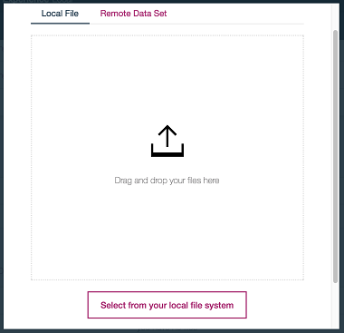

# Infuse AI into your application

In this code pattern, we will create and deploy a customer churn prediction model using IBM Cloud Private for Data. First, we will load customer demographics and trading activity data into Db2 Warehouse. Next, we'll use a Jupyter notebook to visualize the data and build hypotheses for prediction.
Finally, the notebook will build, test, and deploy a prediction model.

The use case describes a stock trader company that can use churn prediction to target offers for at-risk customers. Once deployed, the model can be used for inference from an application using the REST API.

When the reader has completed this code pattern, they will understand how to:

* Load data into Db2 Warehouse
* Run a Jupyter notebook
* Visualize data using Brunel
* Create a model using Spark ML library
* Use Watson Machine Learning to expose the model as a RESTful API endpoint
* Access the model from a remote app for inference (churn risk prediction)


## Flow

1. Data is loaded into Db2 Warehouse
1. Jupyter notebook accesses data
1. Jupyter notebook uses Brunel for information visualization
1. Jupyter notebook uses Spark ML library to create a model
1. Jupyter notebook deploys the model to Watson Machine Learning
1. Remote applications access the model via the REST API

## Prerequisites

This code pattern assumes you have are using IBM Cloud Platform for Data.

The following add-ons are required:
* Db2 Warehouse
* Watson Machine Learning

## Steps

1. [Clone the repo](#1-clone-the-repo)
2. [Set up an analytics project and get data](#2-set-up-an-analytics-project-and-get-data)
3. [Create the notebook](#3-create-the-notebook)
4. [Insert Spark DataFrame](#4-insert-spark-dataframe)
5. [Run the notebook](#5-run-the-notebook)
6. [Analyze the results](#6-analyze-the-results)

### 1. Clone the repo

Clone the `icp4d-customer-churn-classifier` repo locally. In a terminal, run:

```bash
git clone https://github.com/IBM/icp4d-customer-churn-classifier
```

### 2. Set up an analytics project and get data

To get started, open the `Projects` page and set up an analytics project to hold the assets that you want to work with, and then get data for your project.

#### Create a project

To create a project:

* Go to the `Projects` list and click `+ New project`.
* Make sure `Analytics project` is select.
* Provide a `Project name`.
* Click `OK`.
* Stay on the `New` tab.
* Optionally, add a `Description`
* Click `Create`.

#### Add data to your analytics project

You can load data into your projects to access with your notebooks and models.

Access data from local files

You can upload and load local data assets such as CSV files into your project. When you add a local data asset to a project, any collaborator in that project can load data from it; for example, they can load the data into a DataFrame in a notebook.

Upload a local data asset

> Tip: The application assumes that any CSV files that you load have headers and use a comma as a field separator. When you load a CSV file, the application attempts to infer the type of the columns in the file. However, the application might not be able to correctly identify all column types. For example, a column with timestamps might be treated as strings.

To upload the local data asset:

* In your project, using the `Assets` tab, click `Data sets`.
* Click on `+ Add Data Set`.
* Using the `Local File` tab, use drag-and-drop or click `Select from your local file system` and browse the file system and select the `data/03-mergedcustomers.csv` file from your cloned repo. The file is now added to the project.  
   

### 3. Create the notebook

To get the notebook file to add to the project:

* In your project, using the `Assets` tab, click `Notebooks`.
* Click on `+ Add Notebook`.
* Using the `From File` tab:
   * Provide a notebook `Name`.
   * Optionally, provide a `Description`.
   * Use drag-and-drop or click `browse` and select the `notebooks/TradingCustomerChurnClassifierSparkML.ipynb` file from your cloned repo.
   * Click `Create`.

### 4. Insert Spark DataFrame

* Click the *find data* `10/01` icon on the menu bar (last icon).

  

* Place your cursor at the last line of the following cell:

  ```python
  # Use the find data 01/01 icon and under your Local CSV file
  # use "Insert to code" to "Insert Spark DataFrame in Python"
  # here.

  ```

* With the `Local` tab under `10/01`, find the `03-mergedcustomers.csv` file that you added to the project, click `Insert to code` and `Insert Spark DataFrame in Python`
* The inserted code will assign a variable like `df_data_1` (perhaps with a different sequence number). Edit the `#` in the following cell to match the above variable name.

  ```python
  df_churn_pd = df_data_#
  ```

### 5. Run the notebook

Run the entire notebook using the menu `Cell ▷ Run All` or run the cells individually with the play button as shown below.


### 6. Analyze the results

#### When the notebook was created

* A pod was instantiated – which means loading a complete compute Jupyter notebook environment (7+ GB) with all the artifacts from the private ICP-D registry.
* IBM Cloud Private schedules this pod on any VM – wherever CPU and memory resources are available.
* IP addresses and connections are all configured automatically.
* The same working environment can be used by multiple users. If a single pod's resources are not sufficient, another environment is created automatically.
* When the number of users grow, you can add more machines to the ICP-D cluster and scheduling of resources is handled automatically.
* ICP-D's scale-out model is pretty effective.
* You no longer have to wait days or even weeks to get the compute resources.
* IBM Cloud Private makes 40 – 60 percent more efficient use of compute resources. This means more users can be accommodated with same compute capacity. As one task completes, its resources are freed up to work on next one.

#### When you ran the notebook

* During the execution of a cell in a Jupyter notebook, an asterisk `[*]` displays in the square bracket which changes to a sequence number when execution of that cell completes.

* The mix of documentation, code, and output can make a Jupyter output self-explanatory. This also makes it a great environment to "show your work" if you have a hypothesis, do some analysis, and come up with a conclusion.

<!--  TODO: describe and show key output
 -->
* Example Brunel chart:

  

#### Check running environments

* Hover the mouse on the left menu bar and click `Analyze ▷ Active analytics environments`.

  

* Notice the Jupyter runtime environment and check the status. It should be green.

  

<!--
### 1. Try it with curl
### 1. Try it with python
-->

## Sample output

See the notebook with example output and **interactive charts** [here](https://nbviewer.jupyter.org/github/IBM/icp4d-customer-churn-classifier/blob/master/examples/TradingCustomerChurnClassifierSparkML.jupyter-py36.ipynb).

## License

This code pattern is licensed under the Apache License, Version 2. Separate third-party code objects invoked within this code pattern are licensed by their respective providers pursuant to their own separate licenses. Contributions are subject to the [Developer Certificate of Origin, Version 1.1](https://developercertificate.org/) and the [Apache License, Version 2](https://www.apache.org/licenses/LICENSE-2.0.txt).

[Apache License FAQ](https://www.apache.org/foundation/license-faq.html#WhatDoesItMEAN)
