# Infuse AI into your application

In this code pattern, we will create and deploy a customer churn prediction model using IBM Cloud Pak for Data. The basis for our model is a data set that contains customer demographics and trading activity data. We will use a Jupyter notebook to visualize the data, build hypotheses for prediction, and then build, test, and save a prediction model. Finally, we will enable a web service and use the model from an app.

> This code pattern has been updated to include images from the latest version of Cloud Pak for Data, v3.5.0.

The use case describes a stock trader company that can use churn prediction to target offers for at-risk customers. Once deployed, the model can be used for inference from an application using the REST API. A simple app is provided to demonstrate using the model from a Python app.

When the reader has completed this code pattern, they will understand how to:

* Load customer data into Db2 Warehouse
* Run a Jupyter notebook
* Visualize data using Brunel
* Create a model using Spark ML library
* Deploy the model as a web service
* Access the model from an external app for inference (churn risk prediction)


## Flow

1. Data is loaded locally, or optionally into Db2 Warehouse
1. Jupyter notebook accesses data
1. Jupyter notebook uses Brunel for information visualization
1. Jupyter notebook uses Spark ML library to create a model
1. Jupyter notebook saves the model to the repository for deployment
1. Applications access the model via the REST API

## Watch the Video

[](https://www.youtube.com/watch?v=rnoqAagpRaM)

## Prerequisites

The instructions in this code pattern assume you are using IBM Cloud Pak for Data version 3.5.0.

## Steps

Sign in to your IBM Cloud Pak for Data web client. All of the steps are performed using the web client unless stated otherwise.

1. [Clone the repo](#1-clone-the-repo)
2. [Set up an analytics project](#2-set-up-an-analytics-project)
3. [Create a Space for Machine Learning Deployments](#3-create-a-space-for-machine-learning-deployments)
4. [Create the notebook](#4-create-the-notebook)
5. [Insert pandas DataFrame](#5-insert-pandas-dataframe)
6. [Initialize Watson Machine Learning client](#6-initialize-watson-machine-learning-client)
7. [Provide the deployment space information](#7-provide-the-deployment-space-information)
8. [Run the notebook](#8-run-the-notebook)
9. [Analyze the results](#9-analyze-the-results)
10. [Test the model](#10-test-the-model)
11. [Use the model in an app](#11-use-the-model-in-an-app)
12. [(OPTIONAL) Use Db2 Warehouse to store customer data](#12-optional-use-db2-warehouse-to-store-customer-data)

### 1. Clone the repo

Clone the `icp4d-customer-churn-classifier` repo locally. In a terminal, run the following command:

```bash
git clone https://github.com/IBM/icp4d-customer-churn-classifier
```

### 2. Set up an analytics project

To get started, open the `Projects` page and set up an analytics project to hold the assets that you want to work with, and then get data for your project.

#### Create a project

* Launch a browser and navigate to your Cloud Pak for Data deployment.

* Go to the (☰) menu, expand `Projects` and click `All projects`:


* Click on *New project +*. In the dialog that pops up, select the project type as `Analytics project` and click `Next`:

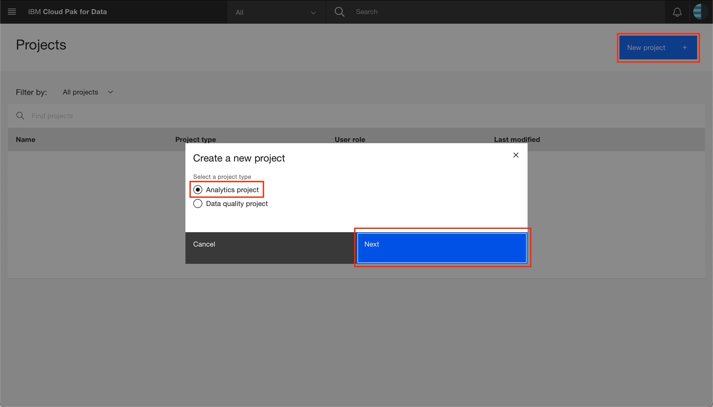

* Click on the top tile for `Create an empty project`:


* Give the project a unique name, an optional description and click `Create`:

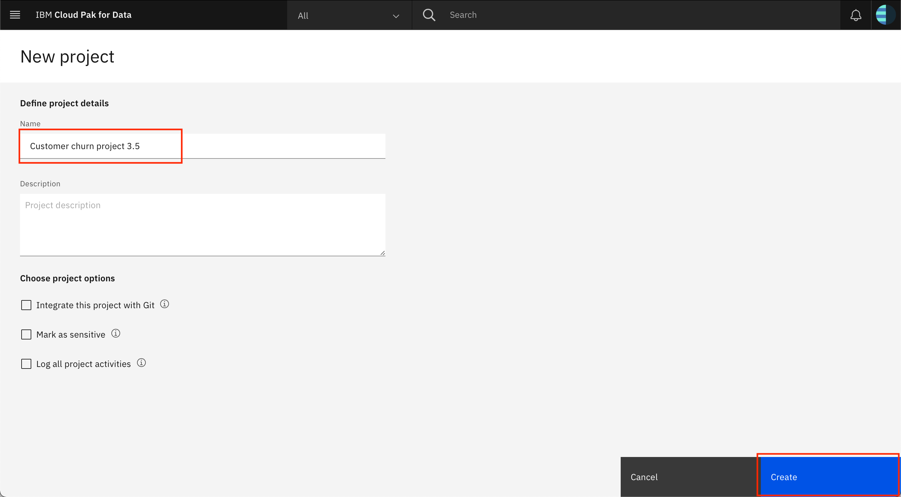

#### Add the data asset

> NOTE: You can optionally load the data into Db2 Warehouse. For instructions, go to [use Db2 Warehouse to store customer data](#12-optional-use-db2-warehouse-to-store-customer-data).

* In your project, on the `Assets` tab, click the `01/00` icon and the `Load` tab, then either drag the [data/mergedcustomers.csv](data/mergedcustomers.csv) file from the cloned repository to the window or navigate to it using `browse for files to upload`:


### 3. Create a Space for Machine Learning Deployments

Before we create a machine learning model, we will have to set up a deployment space where we can save and deploy the model.

Follow the steps in this section to create a new deployment space.

* Navigate to the left-hand (☰) hamburger menu and choose `Deployments`:


* Click on `New deployment space +`:

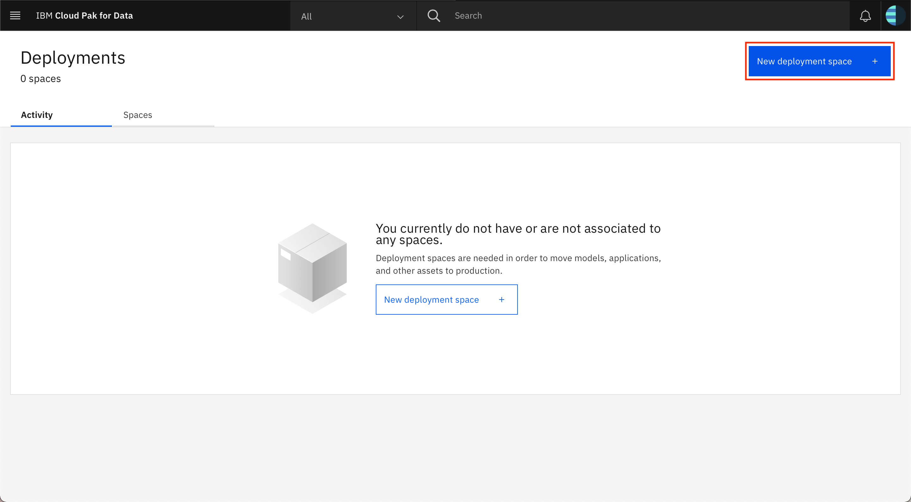

* Click on the top tile for 'Create an empty space':

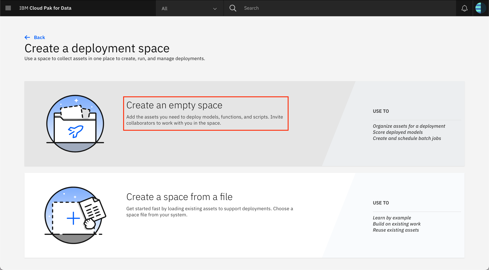

* Give your deployment space a unique name, an optional description, then click `Create`.


* When you get a notification that the space is ready, click on `View new space`.


### 4. Create the notebook

* Back in your project, on the `Assets` tab, either click the `Add to project +` button, and choose `Notebook`, or, if the *Notebooks* section exists, to the right of *Notebooks* click `New notebook +`:


* On the next screen, select the *From file* tab, give your notebook a *name* and an optional *description*, choose the `Python 3.7` environment as the *Runtime* and then either drag the [notebooks/TradingCustomerChurnClassifierSparkML.ipynb](notebooks/TradingCustomerChurnClassifierSparkML.ipynb) file from the cloned repository to the window or navigate to it using `Drag and drop files here or upload.`. Click `Create`:

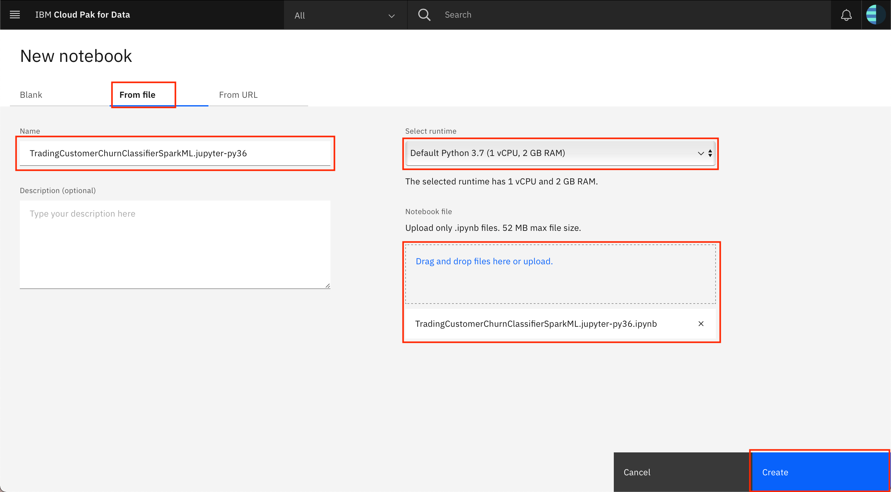

* When the Jupyter notebook is loaded and the kernel is ready then we can start executing cells.


> **Important**: *Make sure that you stop the kernel of your notebook(s) when you are done, in order to conserve memory resources!*


### 5. Insert pandas DataFrame

Now that you are in the notebook, add generated code to insert the data as a DataFrame and fix-up the notebook reference to the DataFrame.

- Place your cursor at the last line of the following cell:

  ```python
  # Use the find data 01/00 icon and under your remote data set
  # use "Insert to code" and "Insert pandas DataFrame
  # here.

  # Add asset from file system
  ```

* Click the *find data* `01/00` icon on the menu bar (last icon). On the *Files* tab, find the data set that you added to the project, click `Insert to code` and `pandas DataFrame`.


* The inserted code will result in a DataFrame assigned to a variable named `df1` or `df_data_1` (perhaps with a different sequence number). Find the code cell like the following code block and edit the `#` to make it match the variable name.

  ```python
  # After inserting the pandas DataFrame code above, change the following
  # df_data_# to match the variable used in the above code. df_churn_pd is used
  # later in the notebook.
  df_churn_pd = df_data_#
  ```

### 6. Initialize Watson Machine Learning client

The Watson Machine Learning client is required to save and deploy our customer churn predictive model, and should be available on your IBM Cloud Pak for Data platform. Find the cell containing the code given below and insert the url, username and password for your IBM Cloud Pak for Data instance:

  ```python
 from ibm_watson_machine_learning import APIClient

# get URL, username and password from your IBM Cloud Pak for Data administrator
wml_credentials = {
  "url": "https://X.X.X.X",
  "username": "*****",
  "password": "*****",
  "instance_id": "wml_local",
  "version" : "3.5"
}

client = APIClient(wml_credentials)
print(client.version)
  ```

### 7. Provide the deployment space information

IBM Cloud Pak for Data uses the concept of deployment spaces, which is where models can be deployed. You can list all the spaces using the .list() function. 

Provide the name of the deployment space that you created in [Step 3](#3-create-a-space-for-machine-learning-deployments) above in the cell containing the following text.

```python
#Insert the name of your deployment space here:
DEPLOYMENT_SPACE_NAME = 'INSERT-YOUR-DEPLOYMENT-SPACE-NAME-HERE'
```

The next cell, then, looks up the deployment space id based on the name that you have provided and prints it out. If you do not receive a space ID as an output to the next cell, verify that you have created a deployment space and have provided the correct deployment space name. Do not proceed until this next cell runs successfully and returns the space_id.

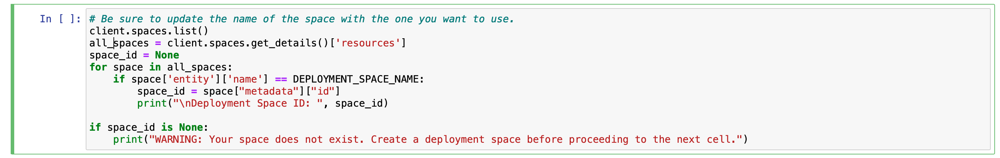

Once you know the deployment space id, update the next cell with this id to set this deployment space as the default deployment space. Further down the notebook, when you deploy the model, it will be deployed to this default deployment space.

```python
# Now set the default space to the GUID for your deployment space. If this is successful, you will see a 'SUCCESS' message.
client.set.default_space('INSERT_SPACE_ID_HERE')
```

### 8. Run the notebook

* Run the entire notebook using the menu `Cell ▷ Run All` or run the cells individually with the play button as shown here.


### 9. Analyze the results

#### When the notebook was created

* A pod was instantiated – which means loading a complete compute Jupyter notebook environment (7+ GB) with all the artifacts from the ICP4D registry.
* This pod is scheduled on any VM in your cluster – wherever CPU and memory resources are available.
* IP addresses and connections are all configured automatically.
* The same working environment can be used by multiple users. If a single pod's resources are not sufficient, another environment is created automatically.
* When the number of users grow, you can add more machines to the ICP4D cluster and scheduling of resources is handled automatically.
* ICP4D's scale-out model is pretty effective.
* You no longer have to wait days or even weeks to get the compute resources.
* More users can be accommodated with same compute capacity. As one task completes, its resources are freed up to work on next one.

#### When you ran the notebook

* During the execution of a cell in a Jupyter notebook, an asterisk `[*]` displays in the square bracket which changes to a sequence number when execution of that cell completes.

* The mix of documentation, code, and output can make a Jupyter output self-explanatory. This also makes it a great environment to "show your work" if you have a hypothesis, do some analysis, and come up with a conclusion.

<!--  TODO: describe and show more key output/analysis
 -->
* Example Brunel chart:


* The model was saved and deployed to the Watson Machine Learning service. Next, we will test the model in the UI. Later, we'll deploy the model for external use.


#### Sample notebook output

See the notebook with example output [here](https://nbviewer.jupyter.org/github/IBM/icp4d-customer-churn-classifier/blob/master/examples/TradingCustomerChurnClassifierSparkML.ipynb).

### 10. Test the model

IBM Cloud Pak for Data provides various options for analytics models such as testing, scoring, evaluating, and publishing. 

We can start testing using the built-in tooling.

* Navigate to the left-hand (☰) hamburger menu and choose `Deployments`:


* On the `Spaces` tab, choose the deployment space you setup previously by clicking on the name of the space.

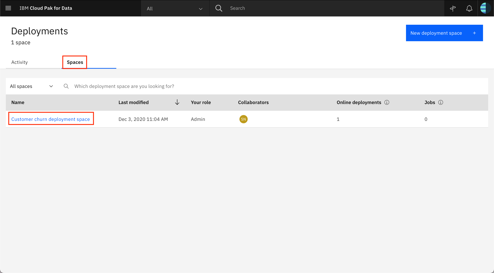

* In your space overview, click the model name that you just built in the notebook.

> **NOTE**: There may be more than one model listed in the 'Models' section. This can happen if you have run the Jupyter notebook more than once. Although you could select any of the models you see listed in the page, the recommendation is to start with whichever model is available that is using a spark-mllib_2.4 runtime.

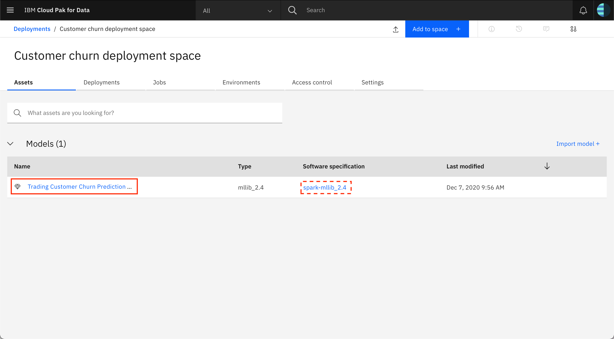

* Click on the deployment that was created using the notebook. 


* The Deployment *API reference* tab shows how to use the model using *cURL*, *Java*, *Javascript*, *Python*, and *Scala*. Click on the corresponding tab to get the code snippet in the language that you want to use:


#### Test the saved model with built-in tooling

* To get to the built-in test tool, click on the Test tab. You can now test the model by either providing the input data using a form, or by providing the input data as a JSON.

> **NOTE**: Testing using JSON is enabled for this model because we have specified the input fields for the model during model creation in the notebook as shown below:

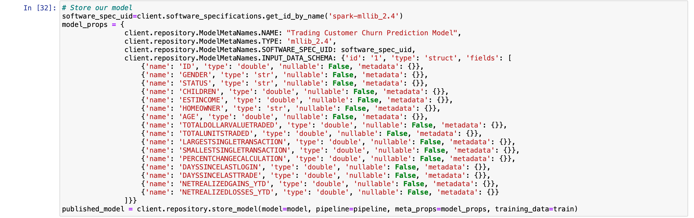

* To test the model by providing data using the form, click on the `Provide input using form` icon and enter the following input in the form fields:

  * `ID`: *4*
  * `GENDER`: *F*
  * `STATUS`: *M*
  * `CHILDREN`: *2*
  * `ESTINCOME`: *52004*
  * `HOMEOWNER`: *N*
  * `AGE`: *25*
  * `TOTALDOLLARVALUETRADED`: *5030*
  * `TOTALUNITSTRADED`: *23*,
  * `LARGESTSINGLETRANSACTION`: *1257*
  * `SMALLESTSINGLETRANSACTION`: *125*
  * `PERCENTCHANGECALCULATION`: *3*
  * `DAYSSINCELASTLOGIN`: *2*
  * `DAYSSINCELASTTRADE`: *19*
  * `NETREALIZEDGAINS_YTD`: *0*
  * `NETREALIZEDLOSSES_YTD`: *251*

* Click the `Predict` button  and the model will be called with the input data. The results will display in the *Result* window. Scroll down to the bottom (Line #110) to see either a "High", a "Low" or a "Medium" for Churn:

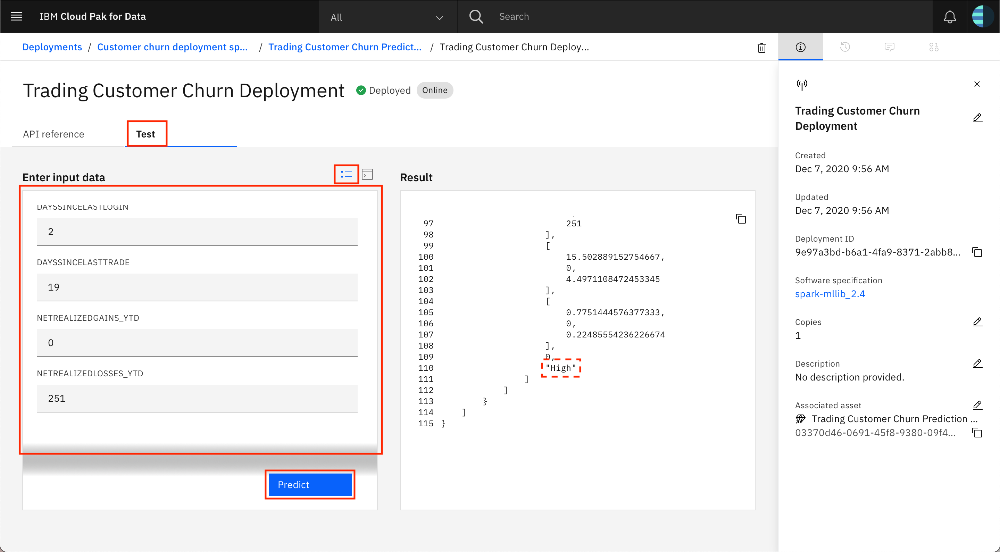

* To test the model by providing an input JSON, click on the `Provide input data as JSON` icon and paste the following data under Body:

```json
{
   "input_data":[
      {
         "fields":[
            "ID", 
            "GENDER", 
            "STATUS",
            "CHILDREN",
            "ESTINCOME",
            "HOMEOWNER",
            "AGE",
            "TOTALDOLLARVALUETRADED",
            "TOTALUNITSTRADED",
            "LARGESTSINGLETRANSACTION",
            "SMALLESTSINGLETRANSACTION",
            "PERCENTCHANGECALCULATION",
            "DAYSSINCELASTLOGIN",
            "DAYSSINCELASTTRADE",
            "NETREALIZEDGAINS_YTD",
            "NETREALIZEDLOSSES_YTD"
         ],
         "values":[
            [
               4,
               "F",
               "M",
               2,
               52004,
               "N",
               60,
               5030,
               23,
               1257,
               125,
               3,
               1,
               1,
               1000,
               0
            ]
         ]
      }
   ]
}
```

* Click the `Predict` button  and the model will be called with the input data. The results will display in the *Result* window. Scroll down to the bottom (Line #110) to see either a "High", a "Low" or a "Medium" for Churn:


#### Test the saved model using cURL

Now that the model is deployed, we can also test it from external applications. One way to invoke the model API is using the cURL command.

> NOTE: Windows users will need the *cURL* command. It is recommended to [download gitbash](https://gitforwindows.org/) for this, as you will also have other tools and you will be able to easily use the shell environment variables in the following steps. Also note that if you are not using gitbash, you may need to change *export* commands to *set* commands.

* In a terminal window (or command prompt in Windows), run the following command to get a token to access the API. Use your Cloud Pak for Data cluster `URL`, `username` and `password`:

```bash
curl -k -X GET https://<cluster-url>/v1/preauth/validateAuth -u <username>:<password>
```

* A json string will be returned with a value for "accessToken" that will look *similar* to this:

```json
{"username":"snyk","role":"Admin","permissions":["access_catalog","administrator","manage_catalog","can_provision"],"sub":"snyk","iss":"KNOXSSO","aud":"DSX","uid":"1000331002","authenticator":"default","accessToken":"eyJhbGciOiJSUzI1NiIsInR5cCI6IkpXVCJ9.eyJ1c2VybmFtZSI6InNueWstYWRtaW4iLCJyb2xlIjoiQWRtaW4iLCJwZXJtaXNzaW9ucyI6WyJhZG1pbmlzdHJhdG9yIiwiY2FuX3Byb3Zpc2lvbiIsIm1hbmFnZV9jYXRhbG9nIiwibWFuYWdlX3F1YWxpdHkiLCJtYW5hZ2VfaW5mb3JtYXRpb25fYXNzZXRzIiwibWFuYWdlX2Rpc2NvdmVyeSIsIm1hbmFnZV9tZXRhZGF0YV9pbXBvcnQiLCJtYW5hZ2VfZ292ZXJuYW5jZV93b3JrZmxvdyIsIm1hbmFnZV9jYXRlZ29yaWVzIiwiYXV0aG9yX2dvdmVycmFuY2VfYXJ0aWZhY3RzIiwiYWNjZXNzX2NhdGFsb2ciLCJhY2Nlc3NfaW5mb3JtYXRpb25fYXNzZXRzIiwidmlld19xdWFsaXR5Iiwic2lnbl9pbl9vbmx5Il0sInN1YiI6InNueWstYWRtaW4iLCJpc3MiOiJLTk9YU1NPIiwiYXVkIjoiRFNYIiwidWlkIjoiMTAwMDMzMTAwMiIsImF1dGhlbnRpY2F0b3IiOiJkZWZhdWx0IiwiaWp0IjoxNTkyOTI3MjcxLCJleHAiOjE1OTI5NzA0MzV9.MExzML-45SAWhrAK6FQG5gKAYAseqdCpublw3-OpB5OsdKJ7whrqXonRpHE7N7afiwU0XNrylbWZYc8CXDP5oiTLF79zVX3LAWlgsf7_E2gwTQYGedTpmPOJgtk6YBSYIB7kHHMYSflfNSRzpF05JdRIacz7LNofsXAd94Xv9n1T-Rxio2TVQ4d91viN9kTZPTKGOluLYsRyMEtdN28yjn_cvjH_vg86IYUwVeQOSdI97GHLwmrGypT4WuiytXRoQiiNc-asFp4h1JwEYkU97ailr1unH8NAKZtwZ7-yy1BPDOLeaR5Sq6mYNIICyXHsnB_sAxRIL3lbBN87De4zAg","_messageCode_":"success","message":"success"}
```

* Use the export command to save the "accessToken" part of this response in the terminal window to a variable called `WML_AUTH_TOKEN`. 

```bash
export WML_AUTH_TOKEN=<value-of-access-token>
```

* Back on the model deployment page, gather the `URL` to invoke the model from the *API reference* by copying the `Endpoint`, and export it to a variable called `URL`:


```bash
export URL=https://blahblahblah.com
```

Now run this curl command from a terminal window to invoke the model with the same payload that was used previously:

```bash
curl -k -X POST --header 'Content-Type: application/json' --header 'Accept: application/json' --header "Authorization: Bearer  $WML_AUTH_TOKEN" -d '{"input_data":[{"fields":["ID", "GENDER", "STATUS", "CHILDREN",  "ESTINCOME", "HOMEOWNER", "AGE", "TOTALDOLLARVALUETRADED", "TOTALUNITSTRADED", "LARGESTSINGLETRANSACTION", "SMALLESTSINGLETRANSACTION", "PERCENTCHANGECALCULATION", "DAYSSINCELASTLOGIN", "DAYSSINCELASTTRADE", "NETREALIZEDGAINS_YTD", "NETREALIZEDLOSSES_YTD"],"values":[[4, "F", "M", 2, 52004, "N", 60, 5030, 23, 1257, 125, 3, 1, 1, 1000, 0]]}]}' $URL
```

A json string similar to the one below will be returned with the response, including a "High", a "Low" or a "Medium" at the end indicating the risk of churn for this customer.

```json
{"predictions":[{"fields":["ID","GENDER","STATUS","CHILDREN","ESTINCOME","HOMEOWNER","AGE","TOTALDOLLARVALUETRADED","TOTALUNITSTRADED","LARGESTSINGLETRANSACTION","SMALLESTSINGLETRANSACTION","PERCENTCHANGECALCULATION","DAYSSINCELASTLOGIN","DAYSSINCELASTTRADE","NETREALIZEDGAINS_YTD","NETREALIZEDLOSSES_YTD","GENDERIndex","GENDERclassVec","STATUSIndex","STATUSclassVec","HOMEOWNERIndex","HOMEOWNERclassVec","features","rawPrediction","probability","prediction","predictedLabel"],"values":[[4,"F","M",2,52004,"N",60,5030,23,1257,125,3,1,1,1000,0,0.0,[1,[0],[1.0]],0.0,[2,[0],[1.0]],0.0,[1,[0],[1.0]],[1.0,1.0,0.0,1.0,4.0,2.0,52004.0,60.0,5030.0,23.0,1257.0,125.0,3.0,1.0,1.0,1000.0,0.0],[2.9466019417475726,8.67282872405483,8.380569334197599],[0.14733009708737863,0.4336414362027415,0.4190284667098799],1.0,"Low"]]}]}
```

### 11. Use the model in an app

You can also access the online model deployment directly through the REST API. This allows you to use your model for inference in any of your apps. For this code pattern, we'll be using a Python Flask application to collect information, score it against the model, and show the results.

#### Install dependencies

> **NOTE**: This application only runs on Python 3.6 and above, so the instructions here are for Python 3.6+ only.

The general recommendation for Python development is to use a virtual environment ([`venv`](https://docs.python.org/3/tutorial/venv.html)). To install and initialize a virtual environment, use the `venv` module:

In a terminal, go to the `stocktraderapp` folder within the cloned repo directory.

```bash
git clone https://github.com/IBM/icp4d-customer-churn-classifier
cd icp4d-customer-churn-classifier/stocktraderapp
```

Initialize a virtual environment with [`venv`](https://docs.python.org/3/tutorial/venv.html).

```bash
# Create the virtual environment using Python. 
# Note, it may be named python3 on your system.
python -m venv venv       # Python 3.X

# Source the virtual environment. Use one of the two commands depending on your OS.
source venv/bin/activate  # Mac or Linux
./venv/Scripts/activate   # Windows PowerShell
```
> **TIP** To terminate the virtual environment use the `deactivate` command.

Finally, install the Python requirements.

```bash
pip install -r requirements.txt
```

#### Update environment variables

It is best practice to store configurable information as environment variables, instead of hard-coding any important information. To reference our model and supply an API key, we will pass these values in via a file that is read; the key-value pairs in this file are stored as environment variables.

Copy the `env.sample` file to `.env`.

```bash
cp env.sample .env
```

Edit the .env file to provide the `URL` and `TOKEN`.

* `URL` is your web service URL for scoring.
* `TOKEN` is your deployment access token.

```bash
# Copy this file to .env.
# Edit the .env file with the required settings before starting the app.

# Required: Provide your web service URL for scoring.
# E.g., URL=https://9.10.222.3:31843/dmodel/v1/project/pyscript/tag/score

URL=

# Required: Provide your web service deployment access token.
# E.g., TOKEN=abCdwFghIjKLMnO1PqRsTuV2wWX3YzaBCDE4.fgH1r2... (and so on, tokens are long).

TOKEN=

# Optional: You can override the server's host and port here.

HOST=0.0.0.0
PORT=5000
```

#### Start the application

Start the flask server by running the following command:

```bash
python StockTraderChurn.py
```

Use your browser to go to [http://0.0.0.0:5000](http://0.0.0.0:5000) and try it out.

> **TIP**: Use `ctrl`+`c` to stop the Flask server when you are done.

#### Sample Output

Enter some sample values into the form:


Click the `Submit` button and the churn prediction is returned:


Pressing `Reset` allows you to go back and enter new values.   

### 12. (OPTIONAL) Use Db2 Warehouse to store customer data

This section provides an alternative to accessing a local csv file in your notebook. This requires that you have created a Db2 Warehouse database deployment in your IBM Cloud Pak for Data cluster or on IBM Cloud. With it, you can access the integrated database console to complete common tasks, such as loading data into the database.

You can follow the instructions provided in Steps 4, 5 and 6 of the [Virtualizing DB2 Warehouse data with data virtualization](https://developer.ibm.com/tutorials/virtualizing-db2-warehouse-data-with-data-virtualization/) tutorial to seed the DB2 warehouse (using the [mergedcustomers.csv](data/mergedcustomers.csv) file provided in this repo), obtain the connection details for your DB2 warehouse and use the connection details to add a connection to your IBM Cloud Pak for Data cluster.

**IMPORTANT**: For this code pattern, remember to seed the DB2 warehouse with the `data/mergedcustomers.csv` file from your cloned repo and not the file mentioned in the *Virtualizing DB2 Warehouse data with data virtualization* tutorial.

#### Add the data asset to your project

* Go the (☰) menu and click *Projects* > *All projects*:


* Click on your project. On your project main page, click on `Add to project +` and select `Connection`:

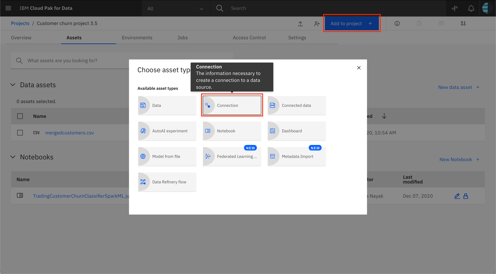

* On the `From platform` tab, select the DB2 Warehouse connection that was added earlier:

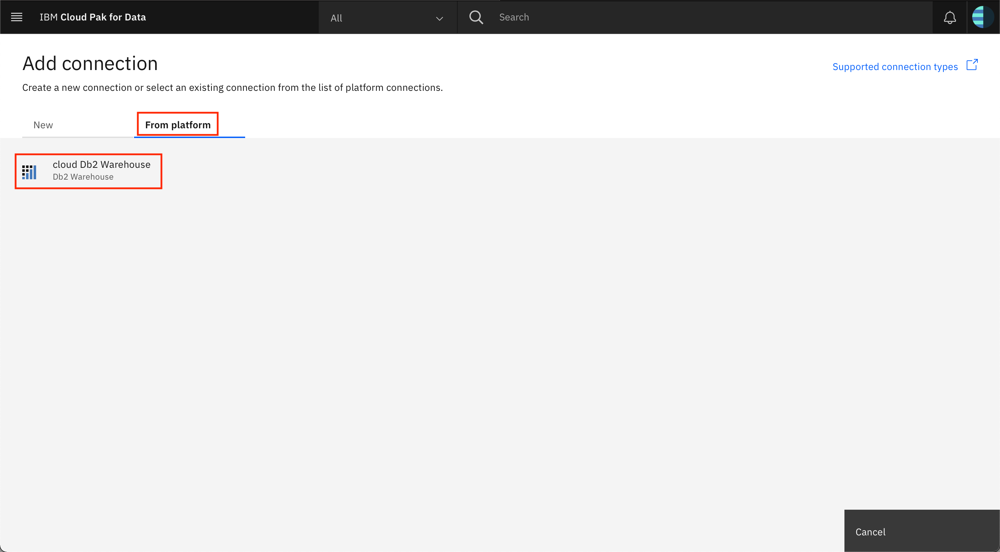

* Provide the username and password for the connection, then click `Test` to test the connection. Once you get a message that says `Connection test passed`, click `Add`:


* You should see the connection listed under *Data Assets* in your project's landing page. Click on `Add to project +` and choose `Connected data`:

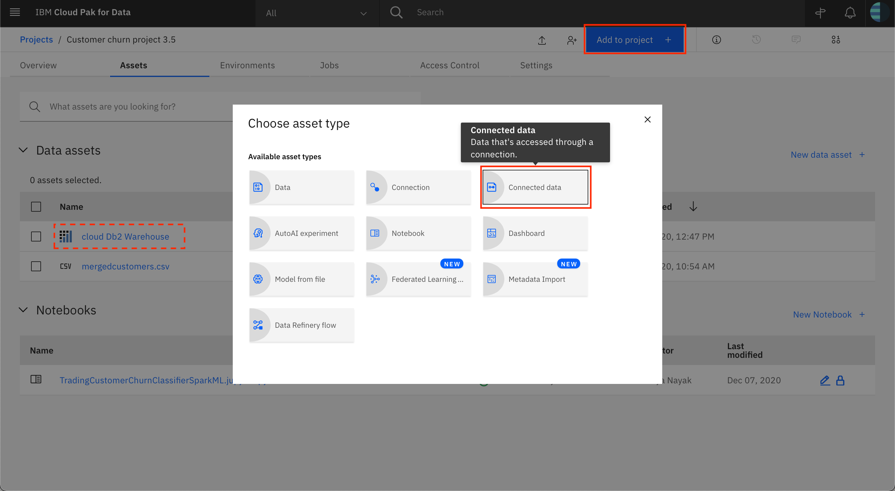

* Click on `Select source`:

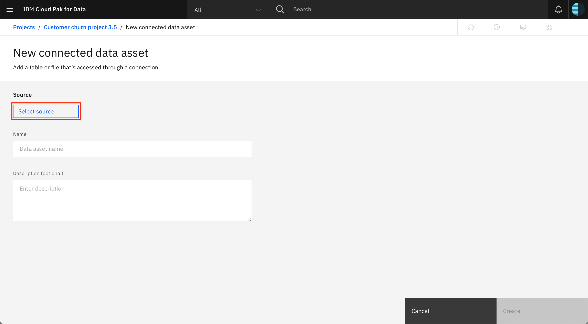

* Select your *DB2 warehouse connection*, select the *schema*, and then select the *table* you had created when loading the file to the DB2 warehouse. Finally click `Select`:


* Provide a *name* and an optional *description* for this data asset and click `Create`:

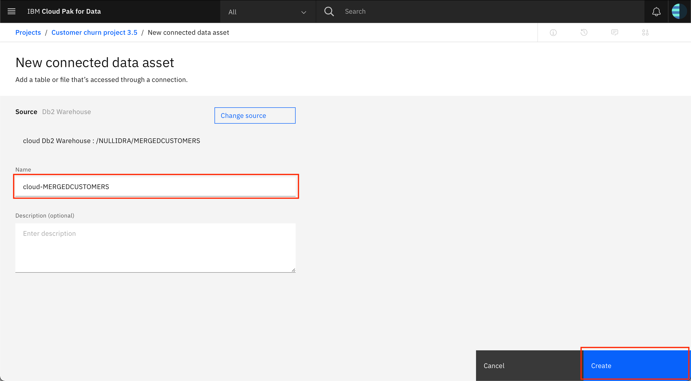

* The database table should now be visible in your project under *Data assets*:


#### Complete the code pattern

Follow the remaining instructions above starting from [3. Create a Space for Machine Learning Deployments](#3-create-a-space-for-machine-learning-deployments). When adding the pandas dataFrame in your notebook, choose the asset name that you had provided when adding the connected data to your project.

## License

This code pattern is licensed under the Apache License, Version 2. Separate third-party code objects invoked within this code pattern are licensed by their respective providers pursuant to their own separate licenses. Contributions are subject to the [Developer Certificate of Origin, Version 1.1](https://developercertificate.org/) and the [Apache License, Version 2](https://www.apache.org/licenses/LICENSE-2.0.txt).

[Apache License FAQ](https://www.apache.org/foundation/license-faq.html#WhatDoesItMEAN)
